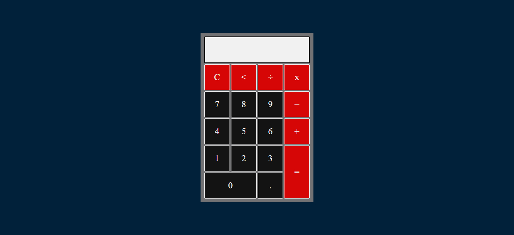
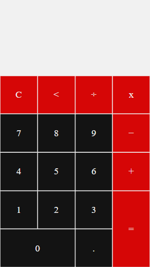

# Fully Responsive Calculator App

## Overview

Users should be able to:

- use this app to calculate the values
- View the optimal layout for the site depending on their device's screen size
- See hover states for all interactive elements on the page

### Screenshot





## My process

### Built with

- Semantic HTML5 markup
- CSS custom properties
- Flexbox
- CSS Grid
- Mobile-first workflow
- JavaScript

### Source Code

```html
<!DOCTYPE html>
<html>
  <head>
    <meta charset="utf-8" />
    <meta name="viewport" content="width=device-width, initial-scale=1.0" />
    <title>Simple Calculator</title>
    <link rel="shortcut icon" href="img/1.png" type="image/x-icon" />
    <link rel="stylesheet" type="text/css" href="style.css" />
  </head>
  <body>
    <div class="container">
      <div class="calculator">
        <input type="text" name="number" class="inputArea" />
        <input type="button" value="C" class="btn calc" onclick="clean()" />
        <input type="button" value="<" class="btn calc" onclick="back()" />
        <input
          type="button"
          value="&divide;"
          class="btn calc"
          onclick="insert('/')"
        />
        <input type="button" value="x" class="btn calc" onclick="insert('*')" />
        <input type="button" value="7" class="btn" onclick="insert(7)" />
        <input type="button" value="8" class="btn" onclick="insert(8)" />
        <input type="button" value="9" class="btn" onclick="insert(9)" />
        <input
          type="button"
          value="&minus;"
          class="btn calc"
          onclick="insert('-')"
        />
        <input type="button" value="4" class="btn" onclick="insert(4)" />
        <input type="button" value="5" class="btn" onclick="insert(5)" />
        <input type="button" value="6" class="btn" onclick="insert(6)" />
        <input type="button" value="+" class="btn calc" onclick="insert('+')" />
        <input type="button" value="1" class="btn" onclick="insert(1)" />
        <input type="button" value="2" class="btn" onclick="insert(2)" />
        <input type="button" value="3" class="btn" onclick="insert(3)" />
        <input type="button" value="=" class="btn calc" onclick="equal('=')" />
        <input type="button" value="0" class="btn" onclick="insert(0)" />
        <input type="button" value="." class="btn" onclick="insert('.')" />
      </div>
    </div>
    <script src="script.js"></script>
  </body>
</html>
```

```css
* {
  margin: 0;
  padding: 0;
  box-sizing: border-box;
}
body {
  background: #c1c1c1;
}
.container {
  display: flex;
  align-items: center;
  justify-content: center;
  width: 100%;
  height: 100vh;
  background: #01213b;
}
.calculator {
  display: grid;
  grid-template-columns: 1fr 1fr 1fr 1fr;
  grid-template-rows: repeat (6, 30px);
  grid-gap: 3px;
  width: 300px;
  padding: 10px;
  border-radius: 2px;
  background: #727275;
}
.inputArea {
  grid-column-start: 1;
  grid-column-end: -1;
  padding: 20px;
  outline: none;
  font-size: 1.5rem;
  font-family: "Times New Roman", Times, serif;
  font-weight: bold;
  background: #f1f1f1;
  color: #000;
  border: 2px solid #000;
  border-radius: 2px;
}
.btn {
  padding: 20px;
  font-size: 1.5rem;
  font-family: "Times New Roman", Times, serif;
  background: #141313;
  color: #f1f1f1;
  border: 1px solid #f1f1f1;
  border-radius: 2px;
}
.btn:active {
  background: #0c0c0c;
}
[value="0"] {
  grid-column: 1 / 3;
}
[value="="] {
  grid-column: 4/ -1;
  grid-row: 5/ 7;
}
.calc {
  background: #d60606;
  color: #f1f1f1;
  border: 1px solid #f1f1f1;
}
.calc:active {
  background: #c40202;
}

/* 
  Break-Point at 480px width
*/
@media screen and (max-width: 480px) {
  .container {
    align-items: flex-end;
    background: #f1f1f1;
  }
  .calculator {
    width: 100%;
    height: 600px;
    grid-gap: 0px;
    padding: 0;
    border: none;
    border-radius: 0;
    background: #f1f1f1;
  }
  .inputArea {
    color: #000;
    font-size: 3rem;
    border: none;
    border-radius: 0;
  }
}
@media screen and (max-width: 320px) and (min-width: 310px) and (min-height: 500px) {
  .calculator {
    height: 500px;
  }
}

/* 
  Break-Point at 1024px
*/
@media screen and (max-width: 1024px) and (min-width: 768px) {
  .container {
    align-items: flex-end;
    background: #f1f1f1;
  }
  .calculator {
    width: 100%;
    height: 80vh;
    grid-gap: 0px;
    padding: 0;
    border: none;
    border-radius: 0;
    background: #f1f1f1;
  }
  .inputArea {
    color: #000;
    font-size: 5rem;
    border: none;
    border-radius: 0;
  }
  .btn {
    font-size: 5rem;
  }
}

```

```js
let inputArea = document.querySelector(".inputArea");
function insert(num) {
  inputArea.value = inputArea.value + num;
}
function equal() {
  if (inputArea) {
    inputArea.value = eval(inputArea.value);
  }
}
function back() {
  let exp = document.querySelector(".inputArea").value;
  inputArea.value = exp.substring(0, exp.length - 1);
}
function clean() {
  inputArea.value = "";
}
};
```

## Author

- Website - [Ayaz Soomro](https://theayazsoomro.000webhostapp.com/)
- Facebook - [@theayazsoomro](https://www.facebook.com/theayazsoomro)
- Instagram - [@theayazsoomro] 
(https://www.instagram.com/theayazsoomro)
- Twitter - [@theayazsoomro](https://www.twitter.com/theayazsoomro)
